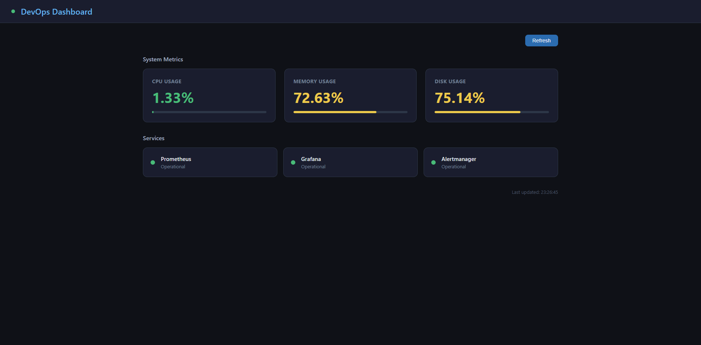
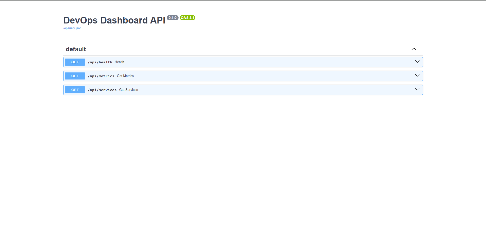

# DevOps Internal Tooling Platform

Internal DevOps dashboard for real-time infrastructure monitoring. Aggregates metrics from Prometheus and displays them in a single-pane-of-glass view.

## Screenshots

### Dashboard


### API Documentation


## Live Demo
- **Dashboard:** http://3.123.209.133:8000
- **API Docs:** http://3.123.209.133:8000/docs

## Architecture

```
Prometheus :9090
     │
     ▼
FastAPI Backend :8000
     │
     ▼
Static HTML Dashboard
```

## Features
- Real-time CPU, Memory, Disk metrics
- Service health status (Prometheus, Grafana, Alertmanager)
- Auto-refresh every 30 seconds
- Color-coded alerts (green/yellow/red thresholds)

## Tech Stack
- **FastAPI** - Python REST API backend
- **Prometheus API** - Metrics data source
- **HTML/CSS/JS** - Frontend dashboard
- **AWS EC2** - Cloud hosting

## API Endpoints

| Endpoint | Description |
|----------|-------------|
| GET / | Dashboard UI |
| GET /api/metrics | CPU, Memory, Disk usage |
| GET /api/services | Service health status |
| GET /api/health | API health check |

## Quick Start

```bash
git clone https://github.com/IvanLuketic2002/devops-dashboard.git
cd devops-dashboard

python3 -m venv venv
source venv/bin/activate  # Linux/Mac
venv\Scripts\activate     # Windows

pip install -r requirements.txt
PROMETHEUS_URL=http://your-prometheus:9090 uvicorn main:app --host 0.0.0.0 --port 8000
```

## Cost
$0 - Running on existing EC2 instance alongside monitoring stack
